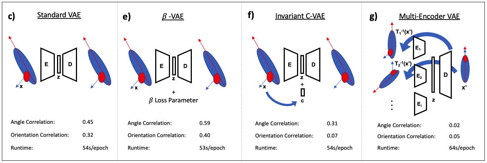
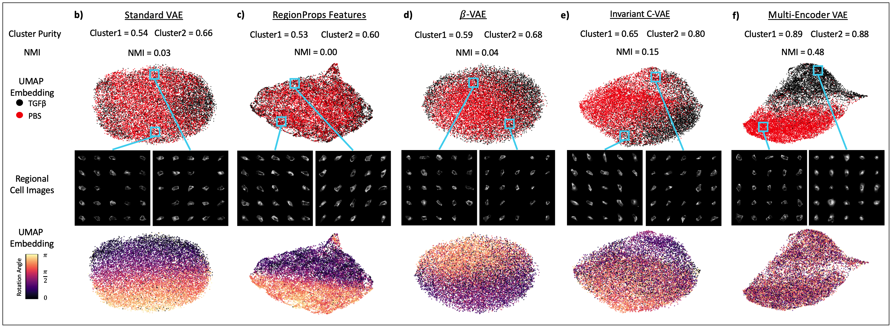

# Base ME-VAE Architecture Implementation
## Introduction
This is a base implementation of the Multi-Encoder Variational Autoencoder (ME-VAE). Uninformative features, especially transformational image features, present a problem for feature extraction in single cell images. It can be hard to disentangle these uninformative features from the output of a conventional VAE. This architecture allows the analyst to remove several uninformative/undesired features simultaneously to improve downstream analysis.
This implementation is published and citable in the BioRxiv here: https://www.biorxiv.org/content/10.1101/2021.04.22.441005v2

  Example of standard VAE model only extracting dominant uninformative features (rotation and polar orientation)

 

  

 

## Method
The principle behind the ME-VAE is to use several parallel encoding blocks, each working with a separate input designed to remove a target uninformative feature. The latent spaces of each encoding block are combined in a multiplication layer to emphasize mutual biological information between the inputs while discouraging information retained in only one input. The combined latent space then goes through a single decoder block to a corrected output. By using randomly transformed inputs with respect to several features and recreating a target corrected output, we can teach the model to extract only biologically informative information without the need for excessive disentangling.
The implementation contained in this repository is only a base version containing two parallel encoding blocks; however, the model can be expanded to accompany the number of features that the analyst desires by adding additional encoding blocks and image pairs (as was done in the paper listed above). This base implementation does not contain image generators to create randomly transformed images on they fly with respect to specific features. Generators should be designed specifically for the needs of the analyst/dataset and the features being removed. The dataset contained here is a  small example of segmented single channel single cell images processed from the Lincs Consortium Dataset, although the model can handle multiplex images containing 40+ channels. Image pairs have already been split into directories with transformations applied for ease of use. This pipeline is built upon the ImageVAE pipeline created by Geoffrey Schau here: https://github.com/schaugf/ImageVAE

  Architectures schematic and improved results from ME-VAE

   

## Prerequisites
- Linux or macOS
- NVIDIA GPU (memory suitable for image size) + CUDA cuDNN
- Tested on Python 3.7.3

